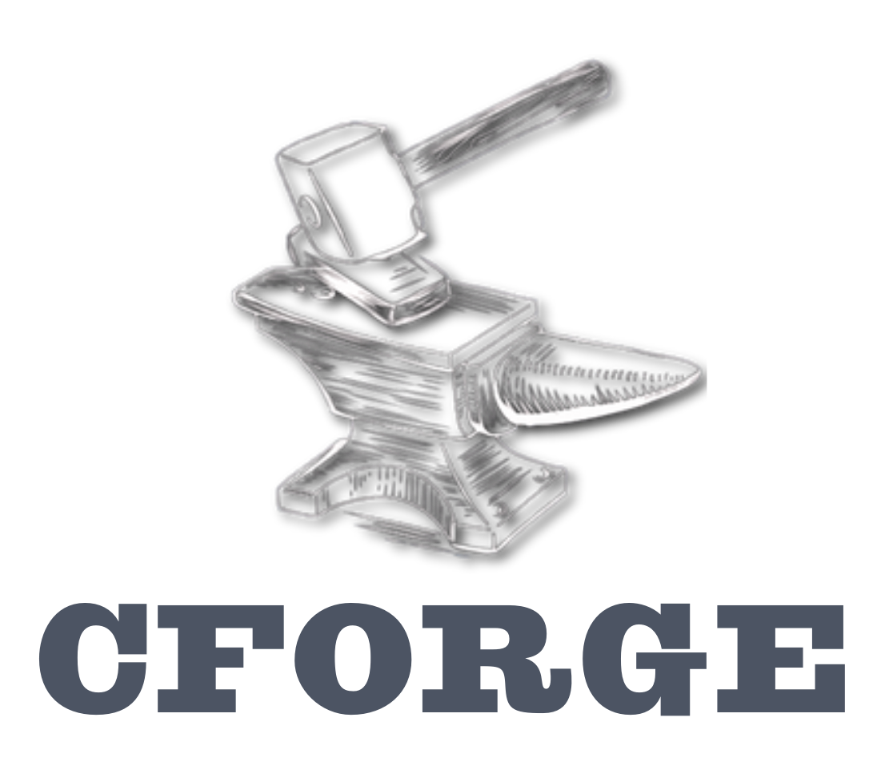

# Example Usage

```crs
import * from std.io

name = input!("What's your name?")
println!("Your name is $name")
```

<p align="center">
    
</p>

# Compiling your project
```sh
cforge -i ./src
```

### Flags
| Flag        | Full Name     | Description                                      | Example Usage                  |
|-------------|---------------|--------------------------------------------------|--------------------------------|
| `-i`        | `--input`     | Specifies the output file.                       | `cforge -o result.exe`         |
| `-od`       | `--outdir`    | Specifies the output directory.                  | `cforge -od /path/to/directory`|
| `-t`        | `--target`    | Specifies the operation system of target         | `cforge -t windows`            |
| `-c`        | `--compile`   | Indicates that the program should be compiled    | `cforge -c -i main.crs`        |
| `           | `--clean`     | Cleans the output directory                      | `cforge clean`                 |


# Running
```sh
cforge run ./src/main.crs
```

## Some Features
### Native JSON and KSON Support
```crs
let json = json_{
    "some_key": "some value"
}

let kmodel = kmodel_`
    some_key: String
`

let kson = kson_`
    some_key = "some value"
`.use_model(kmodel)

println!("$json") // Prints json
println!("$kson") // Prints kson
println!("{}", kson.json()) // Prints json

let kmodel2 = kson_`
    some_key: Integer
`

kson.use_model(kmodel2) // Throws error, invalid property type for "some_key"
```