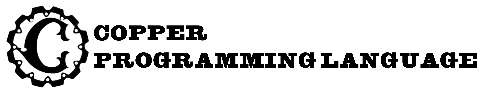
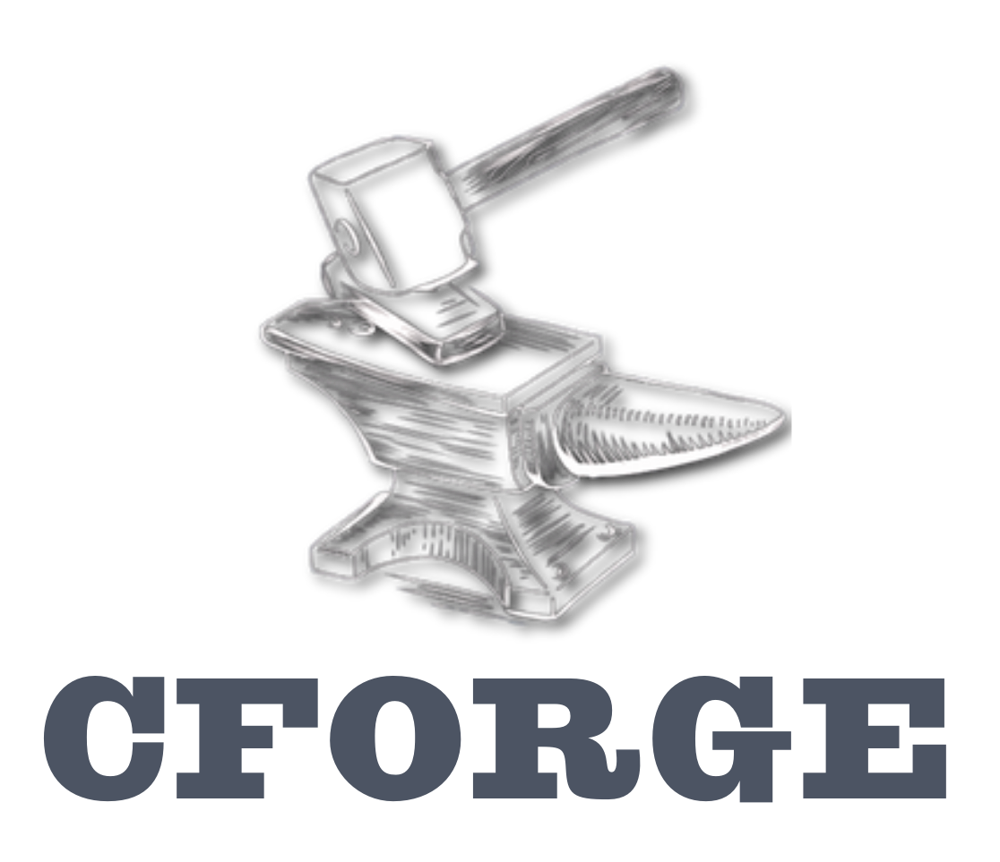

A high-level language that transpiles to Rust. Copper aims to keep Rust's
performance while giving you a syntax that reads like a modern scripting
language — string interpolation, optional chaining, ternaries, and JS-style
loop / match / closure forms — backed by `cforge`, the Copper toolchain.

```crs
import * from std.io

name = input!("What's your name?")
println!("Your name is $name")
```

<p align="center">
    
</p>

## Install

There's also a [GUI installer](./installer-gui) (Tauri, Windows-only for
now) that wraps the script below in a clickable form.

### Script install

See [`docs/INSTALL.md`](./docs/INSTALL.md) for the full guide. TL;DR — one
cross-platform Python installer (needs Python 3.7+):

```sh
python scripts/install.py
```

On Windows you can also double-click `scripts\install.bat`; on Unix run
`bash scripts/install.sh`. Both just forward to `install.py`. The installer
auto-detects admin / root and picks a global or per-user install accordingly.

## Compile a project

```sh
cforge -c -i ./src
```

### Flags

| Flag | Full name | Description | Example |
| --- | --- | --- | --- |
| `-i` | `--input`   | Input file or directory | `cforge -c -i main.crs` |
| `-o` | `--output`  | Output directory | `cforge -o ./build` |
| `-t` | `--target`  | Cross-compile target | `cforge -t windows` |
| `-c` | `--compile` | Compile (no run) | `cforge -c -i main.crs` |
|      | `--clean`   | Clean the output directory | `cforge --clean` |
| `-V` | `--verbose` | Verbose output | `cforge -V run main.crs` |
| `-v` | `--version` | Print version (with build date for pre-releases) | `cforge -v` |

## Run a file

```sh
cforge run ./main.crs
```

`cforge run` (no arg) defaults to `./main.crs` in the current directory.

## Language features

### Classes

```crs
class Greeter {
    name: String

    Greeter(name: String) {
        self.name = name
    }

    void hello(self) {
        println!("Hello, {}!", self.name)
    }
}

Greeter::new("Brian".to_string()).hello()
```

The class lowers to a Rust `struct` + `impl`. The constructor (same name
as the class) becomes `pub fn new(...) -> Self`, and methods declared as
`void name(self)` become `pub fn name(&self)`. Use `cforge run main.crs`
to see it print `Hello, Brian!`.

### Loops, match, optional chaining, ternary

```crs
mut count = 0
loop {
    count++
    if count == 3 { break }
}

mut user: Option<User> = Some(User { name: "Brian".to_string(), age: 30 })
mut age = user?.age              // Some(30)

mut grade = score >= 9 ? "A" : "B"

match n {
    0 => 0,
    1 | 2 | 3 => 1,
    n if n < 0 => -1,
    _ => 2
}
```

See [`examples/`](./examples) for runnable demos of each feature.

### Built-in `cstd` standard library

Rust's standard library is powerful but verbose for everyday scripting tasks
(reading a line of input, sleeping, getting the current time, running a shell
command). Copper ships an embedded `cstd` module — import what you need and
the compiler injects only the helpers you used:

```copper
import { input, read_int, sleep_ms, now_ms, run, exit, env, exists } from cstd

name = input("Your name? ")
age  = read_int("Age: ")
println!("Hello $name ($age)")

started = now_ms()
sleep_ms(100)
println!("slept ~{}ms", now_ms() - started)

println!("HOME = {}", env("HOME"))
println!("ls -> {}", run("ls"))
```

Available functions: `input`, `readln`, `read_int`, `read_float`, `to_int`,
`to_float`, `trim`, `split`, `join`, `exit`, `die`, `panic_if`, `sleep_ms`,
`now_ms`, `env`, `args`, `read_file`, `write_file`, `append_file`, `exists`,
`is_file`, `is_dir`, `list_dir`, `run`, `rand_int`.

The library lives in [`std/cstd.crs`](./std/cstd.crs) (Copper) plus
[`std/cstd_native.rs`](./std/cstd_native.rs) for the few helpers Copper's
transpiler can't yet express cleanly (multi-line method chains, `&[T]`
slice types, `cfg!(target_os=...)`). Editing either file and rebuilding
`cforge` ships the change.

## Project layout

```
copper-lang/
├── src/                # Compiler source (Rust)
├── examples/           # Runnable samples (copper/ → .crs, mui/ → .mui/.crm)
├── scripts/            # Python tooling: install / build / cleanup / diagnose / uninstall / hooks
├── docs/               # INSTALL.md and other guides
├── std/                # Copper standard library (.crs)
├── lson/               # LSON parser binaries (per-OS)
├── assets/             # Logos
├── main.crs            # Default file used by `cforge run` with no argument
├── properties.kson     # Project metadata + dependencies
├── Cargo.toml          # Rust crate definition (cforge)
├── build.rs            # Stamps the build date into pre-release versions
└── README.md
```

## Examples

```sh
cforge run examples/copper/loops.crs           # loop / while / for / break / continue
cforge run examples/copper/interpolation.crs   # "Hello $name", "${expr}"
cforge run examples/copper/collections.crs     # vec literals, closures, ?
cforge run examples/copper/matching.crs        # match arms, if let, while let
cforge run examples/copper/optional.crs        # `?.` optional chaining
cforge run examples/copper/ternary.crs         # `cond ? a : b`
cforge run examples/copper/cstd.crs            # built-in stdlib (input, sleep, env, ...)
cforge run examples/copper/unsafe.crs          # `unsafe func` and `unsafe { ... }` blocks

# MUI examples (need mui-dev on PATH):
cforge run examples/mui/hello/hello.mui
cforge run examples/mui/counter/counter.mui
cforge run examples/mui/keyboard/keyboard.mui   # onKeyInput — keyboard events + println debug
cforge run examples/mui/app/app.mui
```

## Roadmap / TODO

Status of the toolchain. Checked = working today.

**Language (cforge)**
- [x] Core transpile pipeline (`.crs` → Rust), `cforge run` / `-c`
- [x] Variables, functions, classes/structs/impl, imports
- [x] Loops, `match` (guards/`_`/`|`), `if let` / `while let`
- [x] Optional chaining `?.`, ternary `?:`, string interpolation `"${expr}"`
- [x] `unsafe` blocks + functions, raw pointers, generic return types
- [x] `cstd` standard library, `.rs` interop
- [x] CalVer versioning + git commit hash in `--version`
- [ ] Generics in **parameters** (`func<T> name(arg: T)`, `struct S<T>`)
- [ ] Fix `println(var)` / `println("${x}")` → valid Rust (needs a string-literal first arg)
- [ ] `?:` ternary **inside** `${…}` interpolation (captured opaque before the rewrite)
- [ ] `&[T]` slice params in `cstd` (tokenized as a vec literal)

**MUI front-end (`.mui` / `.crm`)**
- [x] `cforge run x.mui` dev render (via `mui-dev`)
- [x] `cforge -c [-r] x.mui` codegen + native build (via `mui-codegen`)
- [x] Component import/reuse, same-file components, `app { }` config + bundles
- [x] `onKeyInput` keyboard handlers (`event.key`, `=`/`+=`/`-=`/`++`, `println!` debug)
- [ ] Codegen **feature parity** with the runtime (string signals, conditional text/color, reactive `if`/`for`, native Stack styling)
- [ ] Folder-input autocomplete without losing focus on rebuild

**Installer**
- [x] MUI-based GUI installer (no Tauri), real `cforge` install (PATH, scope, dedupe)
- [x] `lson` as a git submodule, auto-built on first run
- [ ] Signed installer artifact + CI release packaging

## Contributing

Pull requests are welcome. Please open an issue first for non-trivial changes
so we can discuss the approach.

After cloning, activate the repo's git hooks once so commits and pushes
run the same lint gates CI does:

```sh
python scripts/hooks.py
```

This sets `core.hooksPath` to `.githooks/`. From then on:

- `pre-commit` runs `cargo fmt --check` and `cargo clippy --all-targets -- -D warnings`
- `pre-push` runs `cargo test`

Bypass with `--no-verify` only when you have to (the same checks fail in CI
afterwards).
